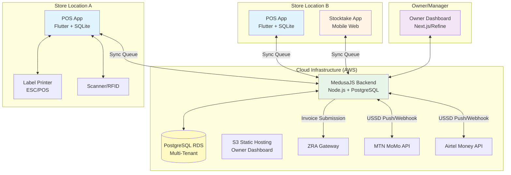

# Design Document: Retail OS

## Overview

The Retail OS is an offline-first, multi-tenant SaaS platform designed for physical retail clothing stores operating in environments with unreliable internet connectivity. The system ensures every garment has a unique digital identity tracked through its entire lifecycle—from stock ingestion to sale, transfer, or loss.

### Key Design Principles

1. **Offline-First Architecture**: All core operations (POS checkout, stock ingestion, stocktake) function without internet connectivity using local SQLite databases
2. **Multi-Tenant Isolation**: Complete data separation enforced at the database layer using PostgreSQL Row-Level Security (RLS)
3. **Audit Trail Integrity**: Immutable append-only logging of all inventory and transaction events
4. **Sequence-Based Sync**: Monotonically increasing sequence numbers ensure deterministic conflict resolution across distributed devices
5. **Role-Based Access Control**: Four distinct roles (Owner, Store Manager, Cashier, Stock Clerk) with minimal privilege enforcement

### System Context

The system serves retailers operating from 1 to 20 physical locations, primarily in Zambia, with integration requirements for:
- **ZRA Smart Invoice** (VSDC API) for tax compliance
- **MTN MoMo** and **Airtel Money** for mobile payments
- **Thermal label printers** (ESC/POS over Bluetooth/USB)
- **Barcode/QR scanners** (HID keyboard emulation or Bluetooth)


---

## Architecture

### High-Level System Architecture



### Architecture Layers

The system follows a layered architecture with clear separation of concerns:

#### 1. Presentation Layer
- **POS Application** (Flutter): Desktop/tablet app for Windows, macOS, Android
- **Stocktake App** (Mobile Web): HTML5-based browser app using device camera
- **Owner Dashboard** (Next.js/Refine): Web portal for reporting and configuration

#### 2. Application Layer (MedusaJS Backend)
- **API Gateway**: RESTful endpoints with JWT authentication
- **Business Logic**: Core domain services (inventory, transactions, sync)
- **Payment Adapters**: Abstract interface for mobile money providers
- **Sync Engine**: Bidirectional replication orchestrator
- **ZRA Service**: Invoice generation and submission

#### 3. Data Layer
- **PostgreSQL (Cloud)**: Central multi-tenant database with RLS
- **SQLite (Local)**: Per-device replicas for offline operation
- **Sync Queue**: Local ordered log of pending operations

#### 4. Integration Layer
- **ZRA VSDC API**: Smart Invoice submission and certificate management
- **Mobile Money APIs**: MTN MoMo and Airtel Money USSD/webhook integration
- **Hardware Drivers**: ESC/POS printer commands, HID scanner input, Bluetooth RFID

---

## Components and Interfaces

### 1. POS Application (Flutter)


**Responsibilities**:
- Cashier authentication (4-digit PIN)
- Product catalog browsing and search
- Cart assembly via scanning or manual entry
- Multi-payment checkout (Cash, Mobile Money, Split)
- Receipt printing and cash drawer control
- Shift opening/closing with cash reconciliation
- Stock ingestion and label generation (Store Manager role)
- Stock transfer initiation
- Real-time sync status display

**Technology Stack**:
- **Framework**: Flutter 3.x (Windows, macOS, Android targets)
- **Database**: Drift (formerly Moor) for type-safe SQLite access
- **State Management**: Riverpod for reactive state
- **Printer**: `esc_pos_bluetooth` or `unified_esc_pos_printer` for ESC/POS commands
- **Scanner**: Platform channels for HID input, `flutter_blue_plus` for Bluetooth

**Key Interfaces**:
```dart
// Local database access
abstract class LocalDatabase {
  Future<Garment?> getGarmentBySerial(String serial);
  Future<void> insertTransaction(Transaction tx);
  Future<List<SyncQueueEntry>> getPendingSync();
  Future<void> markSynced(int sequenceNumber);
}

// Hardware abstraction
abstract class PrinterService {
  Future<List<PrinterDevice>> discoverPrinters();
  Future<void> connect(PrinterDevice device);
  Future<void> printLabel(Label label);
  Future<void> openCashDrawer();
}

abstract class ScannerService {
  Stream<String> get scanStream;
  Future<void> connectBluetooth(String deviceId);
}

// Sync coordination
abstract class SyncService {
  Future<void> enqueueAction(SyncAction action);
  Stream<SyncStatus> get syncStatusStream;
  Future<void> forceSyncNow();
}
```

### 2. Stocktake App (Mobile Web)

**Responsibilities**:
- Stock Clerk authentication (4-digit PIN)
- Stocktake session management (start, scan, commit)
- Camera-based QR scanning (html5-qrcode library)
- RFID wand input via Bluetooth
- Real-time categorization (Matched, Missing, Unexpected)
- Conflict notification display

**Technology Stack**:
- **Framework**: Vanilla JavaScript or lightweight framework (Svelte/Alpine.js)
- **QR Scanning**: `html5-qrcode` library
- **Storage**: IndexedDB for local caching
- **Communication**: Fetch API with service worker for offline queue

**Key API Endpoints**:
```typescript
POST /api/stocktake/start
{
  locationId: string,
  area?: string,
  clerkId: string
}

POST /api/stocktake/scan
{
  sessionId: string,
  serials: string[],  // Batch support for RFID
  timestamp: number
}

POST /api/stocktake/commit
{
  sessionId: string,
  matched: string[],
  missing: string[],
  unexpected: string[]
}
```

### 3. Owner Dashboard (Next.js/Refine)

**Responsibilities**:
- Real-time metrics and KPI display
- Multi-location inventory matrix
- Report generation and export (PDF/CSV)
- Audit trail visualization
- Staff management (CRUD operations)
- Configuration (ZRA credentials, mobile money API keys, reorder thresholds)
- Conflict resolution interface for sync errors

**Technology Stack**:
- **Framework**: Next.js 14 with App Router OR Refine (admin panel framework)
- **UI Library**: Material-UI or Ant Design
- **Charts**: Recharts or Apache ECharts
- **Data Fetching**: React Query (TanStack Query)
- **Deployment**: AWS Amplify or S3 + CloudFront

**Key Features**:
- **Dashboard Page**: Metric cards, hourly sales graph, transaction feed
- **Inventory Matrix**: Variant × Location grid with color-coded stock levels
- **Reports Section**: Filterable reports (Best Sellers, Slowest Moving, Staff Performance, Stock Ageing, Profit Margin)
- **Audit Trail**: Immutable chronological log with advanced filtering
- **Settings**: Tenant configuration, user management, API credentials

### 4. MedusaJS Backend

**Responsibilities**:
- Multi-tenant data isolation enforcement
- API endpoint orchestration
- Sync queue processing and conflict resolution
- ZRA invoice generation and submission
- Mobile money payment orchestration
- Webhook handling (payment confirmations)
- Background jobs (sync reconciliation, report generation)

**Technology Stack**:
- **Runtime**: Node.js 18+
- **Framework**: MedusaJS 2.x (e-commerce framework with extensibility)
- **Database**: PostgreSQL 15+ with Row-Level Security
- **ORM**: MedusaJS's built-in data layer (based on Mikro-ORM)
- **Job Queue**: Bull (Redis-based) for background processing
- **Deployment**: AWS EC2 with Auto Scaling Group + Application Load Balancer

**Custom Services** (MedusaJS extensions):
```typescript
// Sync orchestration
class SyncEngineService {
  async processSyncBatch(tenantId: string, entries: SyncQueueEntry[]): Promise<SyncResult>
  async detectConflicts(entry: SyncQueueEntry): Promise<Conflict[]>
  async resolveConflict(conflictId: string, resolution: Resolution): Promise<void>
}

// ZRA integration
class ZraInvoiceService {
  async generateInvoice(transaction: Transaction, certificate: ZraCertificate): Promise<ZraInvoice>
  async submitToGateway(invoice: ZraInvoice): Promise<SubmissionResult>
  async validateCertificate(certificate: ZraCertificate): Promise<boolean>
}

// Payment abstraction
interface PaymentAdapter {
  initiatePayment(amount: number, phoneNumber: string): Promise<PaymentRequest>
  handleWebhook(payload: unknown, signature: string): Promise<PaymentStatus>
  cancelPayment(requestId: string): Promise<void>
}

class MtnMomoAdapter implements PaymentAdapter { /* ... */ }
class AirtelMoneyAdapter implements PaymentAdapter { /* ... */ }
```

**Custom API Routes**:
```
POST   /admin/sync/batch              # Receive sync queue from device
GET    /admin/sync/conflicts          # Fetch unresolved conflicts
POST   /admin/sync/resolve/:id        # Resolve specific conflict

POST   /admin/stock/ingest            # Bulk serial generation
POST   /admin/stock/transfer          # Inter-location transfer
POST   /admin/stocktake/commit        # Finalize stocktake

POST   /store/transactions            # Record completed sale
POST   /store/payment/mobile/:provider # Initiate mobile money payment
POST   /store/payment/webhook         # Handle payment confirmations

GET    /admin/reports/:type           # Generate named reports
GET    /admin/audit-trail             # Query audit logs
POST   /admin/staff                   # Staff management
PUT    /admin/settings/zra            # Update ZRA credentials
```

---

## Data Models

### Core Entities Schema

#### Tenant
```sql
CREATE TABLE tenants (
  id UUID PRIMARY KEY DEFAULT gen_random_uuid(),
  name VARCHAR(255) NOT NULL,
  subscription_tier VARCHAR(50) NOT NULL, -- 'boutique_starter' | 'growth' | 'enterprise_fleet'
  active_locations_count INTEGER DEFAULT 0,
  active_devices_count INTEGER DEFAULT 0,
  created_at TIMESTAMP DEFAULT NOW(),
  updated_at TIMESTAMP DEFAULT NOW()
);
```

#### Location
```sql
CREATE TABLE locations (
  id UUID PRIMARY KEY DEFAULT gen_random_uuid(),
  tenant_id UUID NOT NULL REFERENCES tenants(id),
  name VARCHAR(255) NOT NULL,
  address TEXT,
  is_active BOOLEAN DEFAULT TRUE,
  created_at TIMESTAMP DEFAULT NOW(),
  CONSTRAINT fk_tenant FOREIGN KEY (tenant_id) REFERENCES tenants(id) ON DELETE CASCADE
);

-- Row-Level Security
ALTER TABLE locations ENABLE ROW LEVEL SECURITY;
CREATE POLICY tenant_isolation ON locations
  USING (tenant_id = current_setting('app.current_tenant')::UUID);
```

#### Staff
```sql
CREATE TABLE staff (
  id UUID PRIMARY KEY DEFAULT gen_random_uuid(),
  tenant_id UUID NOT NULL REFERENCES tenants(id),
  name VARCHAR(255) NOT NULL,
  role VARCHAR(50) NOT NULL, -- 'owner' | 'store_manager' | 'cashier' | 'stock_clerk'
  location_id UUID REFERENCES locations(id),
  pin_hash VARCHAR(255) NOT NULL, -- bcrypt hash of 4-digit PIN
  is_active BOOLEAN DEFAULT TRUE,
  failed_login_attempts INTEGER DEFAULT 0,
  lockout_until TIMESTAMP,
  created_at TIMESTAMP DEFAULT NOW(),
  updated_at TIMESTAMP DEFAULT NOW()
);

ALTER TABLE staff ENABLE ROW LEVEL SECURITY;
CREATE POLICY tenant_isolation ON staff
  USING (tenant_id = current_setting('app.current_tenant')::UUID);
```

#### Variant
```sql
CREATE TABLE variants (
  id UUID PRIMARY KEY DEFAULT gen_random_uuid(),
  tenant_id UUID NOT NULL REFERENCES tenants(id),
  name VARCHAR(255) NOT NULL,
  category VARCHAR(100),
  color VARCHAR(50),
  size VARCHAR(20),
  cost_price DECIMAL(10,2) NOT NULL,
  retail_price DECIMAL(10,2) NOT NULL,
  reorder_threshold INTEGER DEFAULT 10,
  created_at TIMESTAMP DEFAULT NOW(),
  updated_at TIMESTAMP DEFAULT NOW(),
  UNIQUE(tenant_id, name, color, size)
);

ALTER TABLE variants ENABLE ROW LEVEL SECURITY;
CREATE POLICY tenant_isolation ON variants
  USING (tenant_id = current_setting('app.current_tenant')::UUID);
```

#### Garment (Serial)